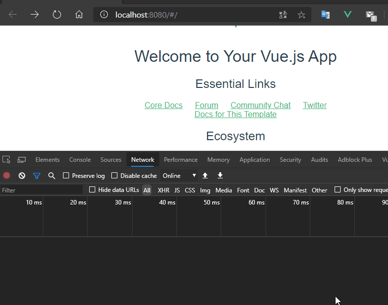
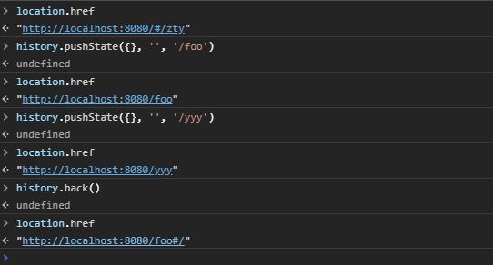
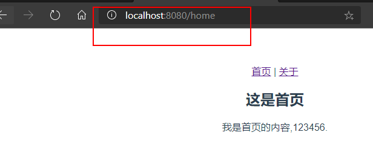
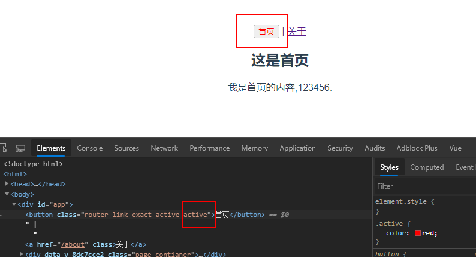

# （十七）vue-router

## 17.1	路由简介

**什么是路由？**

- 路由就是通过互联的网络把信息用源地址传送到目的地的活动

- 路由提供了两种机制：路由和传送
  - 路由是决定数据包从来源到目的地的路径
  - 转送就是将数据转移
- 路由表
  - 路由表本质就是一个映射表，决定了数据包的指向


## 17.2	前端/后端路由

1. 后端渲染（服务端渲染）
   jsp技术
   后端路由，后端处理URL和页面映射关系，例如springmvc中的@requestMapping注解配置的URL地址，映射前端页面
2. 前后端分离（ajax请求数据）
   后端只负责提供数据
   静态资源服务器（html+css+js）
   ajax发送网络请求后端服务器，服务器回传数据
   js代码渲染dom
3. 单页面富应用（SPA页面）
   前后端分离加上前端路由，前端路由的url映射表不会向服务器请求，是单独url的的页面自己的ajax请求后端，后端只提供api负责响应数据请求。改变url，页面不进行整体的刷新。
   整个网站只有一个html页面。

## 17.3	URL的hash和HTML5的history

### 17.3.1	URL的hash

- URL的hash是通过锚点(#)，其本质上改变的是window.location的href属性。
- 可以通过直接赋值location.hash来改变href，但是页面并不会发生刷新。


使用命令`vue init webpack 01-vue-router-vuecli2`创建新的vuecli2工程,等待创建完成后，使用`npm run dev`启动服务器，在浏览器通过http://localhost:8080进入工程主页。 测试通过改变hash，查看是否会刷新页面，浏览器的url地址是否改变。



> 结论

测试发现url的地址栏改变了变成了http://localhost:8080/#/zty，通过查看network发现只有favicon.ico资源重新请求了，这个是工程的logo图标，其他资源都未请求。可以通过改变hash改变url，此时页面是未刷新的。

vue-router其实用的就是这样的机制，改变url地址，这个url地址存在一份路由映射表里面，比如`/user`代表要请求用户页面，只要配置了这个路由表（路由关系），就可以前端跳转而不刷新页面，所有的数据请求都走ajax。

### 17.3.1	HTML5的history模式

> pushState

同样的使用HTML5的history模式也是不会刷新页面的,history对象栈结构，先进后出，pushState类似压入栈中，back是回退。

```js
hristory.pushState({}, '', '/foo')
history.back()
```



> replaceState

replaceState模式与pushState模式区别在于replaceState模式浏览器没有返回只是替换，不是压入栈中。

```js
history.replaceState({}, '', 'home')
```


> go

go只能在pushState模式中使用，go是前进后退到哪个历史页面。

```js
history.go(-1)//回退一个页面
history.go(1)//前进一个页面
history.forward()//等价于go(1)
history.back()//等价于go(-1)
```

## 17.4	vue-router的安装配置

1. 使用`npm install vue-router --save`来安装vue-router插件模块

2. 在模块化工程中使用他(因为是一个插件，所以可以通过Vue.user来安装路由功能)

   - 在src下创建一个router文件夹（一般安装vue-router时候会自动创建）用来存放vue-router的路由信息导入路由对象，并且调用**Vue.use(VueRouter)**
   - 创建路由实例，并且传入路由**映射配置**
   - 在vue实例中挂载创建的**路由实例对象**

   > router文件夹中的index.js

```js
/**
 * 配置路由相关信息
 * 1.先导入vue实例和vue-router实例
 */
import Vue from 'vue'
import Router from 'vue-router'
import HelloWorld from '@/components/HelloWorld'

// 2. 通过Vue.use(插件)，安装插件
Vue.use(Router)
//3. 创建 router路由对象
const routes = [
  //配置路由和组件之间的对应关系
  {
    path: '/',//url
    name: 'HelloWorld',
    component: HelloWorld //组件名
  }
]
const router = new Router({
  //配置路由和组件之间的应用关系
  routes
})
//4.导出router实例
export default router
```

> main.js中挂载router对象

```js
/* eslint-disable no-new */
new Vue({
  el: '#app',
  router,//使用路由对象，简写对象增强写法
  render: h => h(App)
})
```

## 17.4	vue-router的使用

### 17.4.1	创建路由组件

在components文件夹下创建2个组件。

> Home组件

```vue
<template>
  <div class="page-contianer">
    <h2>这是首页</h2>
    <p>我是首页的内容,123456.</p>
  </div>
</template>
<script type="text/ecmascript-6">
export default {
  name: 'Home'
}
</script>
<style scoped>
</style>
```

> About组件

```vue
<template>
  <div class="page-contianer">
    <h2>这是关于页面</h2>
    <p>我是关于页面的内容，about。</p>
  </div>
</template>
<script type="text/ecmascript-6">
export default {
  name: 'About'
}
</script>
<style scoped>
</style>
```

### 17.4.2	配置路由映射：组件和路径映射关系

在路由与组件对应关系配置在`routes`中。

> 修改index.js

```js
import Vue from 'vue'
import Router from 'vue-router'
import Home from '@/components/Home'

// 2. 通过Vue.use(插件)，安装插件
Vue.use(Router)
//3. 创建 router路由对象
const routes = [
  //配置路由和组件之间的对应关系
  {
    path: '/home',//home  前端路由地址
    name: 'Home',
    component: Home //组件名
  },
  {
    path: '/about',//about 前端路由地址
    name: 'About',
    component: () => import('@/components/About') //懒加载组件
  }
]
const router = new Router({
  //配置路由和组件之间的应用关系
  routes
})
//4.导出router实例
export default router
```


### 17.4.3	使用路由：通过`<router-link>`和`<router-view>` 

在app.vue中使用`<router-link>`和`<router-view>` 两个全局组件显示路由。

> `<router-link>`是全局组件，最终被渲染成a标签，但是`<router-link>`只是标记路由指向类似一个a标签或者按钮一样，但是我们点击a标签要跳转页面或者要显示页面，所以就要用上`<router-view>`。
>
> `<router-view>`  是用来占位的，就是路由对应的组件展示的地方，该标签会根据当前的路径，动态渲染出不同的组件。
>
> 路由切换的时候切换的是`<router-view>`挂载的组件，其他不会发生改变。
>
> `<router-view>`默认使用hash模式，可以在index.js中配置修改为history模式。

> app.vue修改template

```vue
<template>
  <div id="app">
    <router-link to="/home">首页</router-link> |
    <router-link to="/about">关于</router-link>
    <router-view/>
  </div>
</template>
```

使用`npm run dev`启动项目，此时`<router-view>`在`<router-link>`下面，那渲染页面就在下面，此时未配置路由的默认值，所以第一次进入网页的时候`<router-view>`占位的地方是没有内容的。


### 17.4.4	路由的默认值和history模式

> 路由的默认值，修改index.js的routes

```js
const routes = [
  {
    path: '',
    redirect: '/home'//缺省时候重定向到/home
  },
  //配置路由和组件之间的对应关系
  {
    path: '/home',//home  前端路由地址
    name: 'Home',
    component: Home //组件名
  },
  {
    path: '/about',//about 前端路由地址
    name: 'About',
    component: () => import('@/components/About') //懒加载组件
  }
]
```

添加缺省值，并重定向到`/home`路径，此时打开http://localhost:8080，直接显示home组件内容。

> 修改hash模式为history模式，修改index.js的router对象

```js
const router = new Router({
  //配置路由和组件之间的应用关系
  routes,
  mode: 'history'//修改模式为history
})
```

此时发现浏览器地址栏的URL是没有`#`的。



### 17.4.5	`<router-link>`的其他属性

1. `to`属性：用于跳转到指定路径。

2. `tag`属性：可以指定`<router-link>`之后渲染成什么组件使用`<router-link to='/home' tag='button'>`会被渲染成一个按钮，而不是a标签。

3. `relapce`属性：在history模式下指定`<router-link to='/home' tag='button' replace>`使用`replaceState`而不是pushState，此时浏览器的返回按钮是不能使用的。

4. `active-class`属性：当`<router-link>`对应的路由匹配成功的时候，会自动给当前元素设置一个`router-link-active`的class，设置active-class可以修改默认的名称。

   - 在进行高亮显示的导航菜单或者底部tabbar时，会用到该属性

   - 但是通常不会修改类的属性，会直接使用默认的`router-link-active`

   - `<router-link to='/home' tag='button' active-class='active'>`此时被选中的`<router-link>`就会有active的class。

   - 如果每个`<router-link>`都要加上`active-class='active'`，那就在路由里面统一更改。

     

   ```js
   const router = new Router({
     //配置路由和组件之间的应用关系
     routes,
     mode: 'history',//修改模式为history
     linkActiveClass: 'active'
   })
   ```

   

   ```vue
   <template>
     <div id="app">
       <router-link to="/home" tag='button' replace active-class='active'>首页</router-link> |
       <router-link to="/about" active-class='active'>关于</router-link>
       <router-view/>
     </div>
   </template>
   
   <script>
   export default {
     name: 'App'
   }
   </script>
   
   <style>
   #app {
     font-family: 'Avenir', Helvetica, Arial, sans-serif;
     -webkit-font-smoothing: antialiased;
     -moz-osx-font-smoothing: grayscale;
     text-align: center;
     color: #2c3e50;
     margin-top: 60px;
   }
   .active {
     color: red;
   }
   </style>
   ```

   修改app.vue文件此时被选中的`<router-link>`就有了active属性，给active的class加上字体变红的css。

   

### 17.4.6	通过代码修改路由跳转

> $router属性

```vue
<template>
  <div id="app">
    <!-- <router-link to="/home" tag='button' replace active-class='active'>首页</router-link> |
    <router-link to="/about" active-class='active'>关于</router-link> -->
    <button @click="homeClick">首页</button>|
    <button @click="aboutClick">关于</button>
    <router-view/>
  </div>
</template>

<script>
export default {
  name: 'App',
  methods: {
    homeClick() {//通过代码的路径修改路由
      this.$router.push('/home')//push 等价于pushState
      // this.$router.replace('/home')//replace 等价于replaceState
      console.log("homeClick")
    },
    aboutClick() {
      this.$router.push('/about')
      // this.$router.replace('/about')//replace 等价于replaceState
      console.log("aboutClick")
    }
  }
}
</script>

<style>
#app {
  font-family: 'Avenir', Helvetica, Arial, sans-serif;
  -webkit-font-smoothing: antialiased;
  -moz-osx-font-smoothing: grayscale;
  text-align: center;
  color: #2c3e50;
  margin-top: 60px;
}
.active {
  color: red;
}
</style>
```

修改app.vue，将`<router-link>`换成`button`等任何组件，添加上点击事件，并写好点击事件响应方法，此时使用`this.$router.push('/home')`，push方法 等价于pushState方法，replace 方法等价于replaceState方法。

